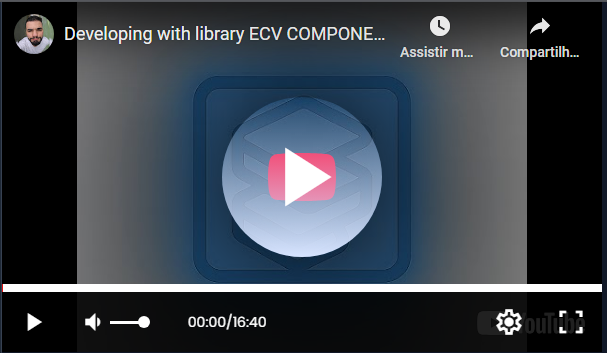

# Lit-Player-Youtube

[](https://www.npmjs.com/package/lit-player-youtube)
[](https://opensource.org/licenses/MIT)
[](https://www.npmjs.com/package/lit-player-youtube)

---

**LitPlayerYoutube** is a YouTube-based video player built with [Lit](https://lit.dev/) that uses the official YouTube API to control video playback.

Lightweight, customizable, and easy to use, it can be used as a pure Web Component or integrated via React with the official wrapper.

---

## Table of Contents

- [Requirements](#requirements)
- [Installation](#installation)
- [Usage](#usage)
- [Importing](#importing)
- [Using in Lit](#using-in-lit)
- [Using in React](#using-in-react)
- [Controlling Dimensions](#controlling-dimensions)
- [Example](#example)
- [Contributing](#contributing)
- [Developer](#developer)
- [Documentation - Page](#Documentation - Page)
- [License](#license)

---

## Requirements

- Node.js >= 14.x
- Modern browser with Web Components support

---

## Installation

```bash
npm install lit-player-youtube
```

## Usage
To use the component, simply import it and place the tag in your project. No need to instantiate classes or call methods directly.

## Importing
LIT:
```typescript
    import { LitPlayerYoutube } from "lit-player-youtube";
```

REACT:
```typescript
    import { LitPlayerYoutubeReact } from "lit-player-youtube";
```

## Using in Lit
Example controlling width and height:
```html
<div style="width: 600px; height: 350px;">
    <lit-youtube-player video="https://www.youtube.com/watch?v=tPBbeszlIXw"></lit-youtube-player>
</div>
```

## Using in React
Example controlling width and height:
```typescript
import React from "react";
import { LitPlayerYoutubeReact } from "lit-player-youtube";

function App() {
  return (
    <div style={{ width: "600px", height: "350px" }}>
      <LitPlayerYoutubeReact video="https://www.youtube.com/watch?v=tPBbeszlIXw" />
    </div>
  );
}

export default App;
```

### Example



## Controlling Dimensions
You can control the player size by wrapping the component inside a container with specific dimensions, 
as the component adapts to 100% width and height of its container.

The component is also responsive.

## Contributing

Contributions are very welcome! To contribute, follow these steps:
1. Fork this repository.
2. Create a feature branch (git checkout -b feature/new-feature).
3. Commit your changes (git commit -m 'Add new feature').
4. Push to the branch (git push origin feature/new-feature).
5. Open a Pull Request.

## Documentation - Page
https://leonardolaraujo.github.io/lit-player-youtube/

## License
MIT © Leonardo Leal Araujo
